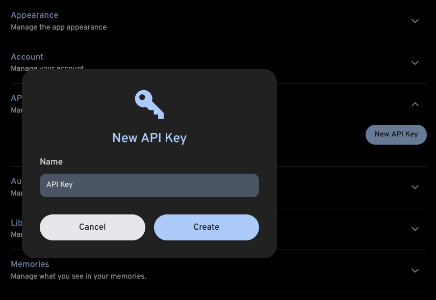

# The Immich CLI

Immich has a CLI that allows you to perform certain actions from the command line. This CLI replaces the [legacy CLI](https://github.com/immich-app/CLI) that was previously available. The CLI is hosted in the [cli folder of the the main Immich github repository](https://github.com/immich-app/immich/tree/main/cli).

## Features

- Upload photos and videos to Immich
- Check server version

More features are planned for the future.

:::tip Google Photos Takeout
If you are looking to import your Google Photos takeout, we recommend this community maintained tool [immich-go](https://github.com/simulot/immich-go)
:::

## Requirements

- Node.js 20 or above
- Npm

If you can't install node, there is also a docker version available.

## Installation (NPM)

```bash
npm i -g @immich/cli
```

NOTE: if you previously installed the legacy CLI, you will need to uninstall it first:

```bash
npm uninstall -g immich
```

## Installation (Docker)

If npm is not available on your system you can try the docker version

```bash
docker run -it -v "$(pwd)":/import:ro -e IMMICH_API_KEY=https://your-immich-instance/api -e IMMICH_API_KEY=your-api-key ghcr.io/immich-app/immich-cli:latest
```

Please modify the `IMMICH_INSTANCE_URL` and `IMMICH_API_KEY` environment variables as suitable. You can also use a docker env file to store your sensitive API key.

## Usage

```
immich
```

```
Usage: immich [options] [command]

Command line interface for Immich

Options:
  -V, --version                     output the version number
  -d, --config                      Configuration directory (env: IMMICH_CONFIG_DIR)
  -h, --help                        display help for command

Commands:
  upload [options] [paths...]       Upload assets
  server-info                       Display server information
  login-key [instanceUrl] [apiKey]  Login using an API key
  logout                            Remove stored credentials
  help [command]                    display help for command
```

## Commands

The upload command supports the following options:

```
Usage: immich upload [options] [paths...]

Upload assets

Arguments:
  paths                    One or more paths to assets to be uploaded

Options:
  -r, --recursive          Recursive (default: false, env: IMMICH_RECURSIVE)
  -i, --ignore [paths...]  Paths to ignore (env: IMMICH_IGNORE_PATHS)
  -h, --skip-hash          Don't hash files before upload (default: false, env: IMMICH_SKIP_HASH)
  -H, --include-hidden     Include hidden folders (default: false, env: IMMICH_INCLUDE_HIDDEN)
  -a, --album              Automatically create albums based on folder name (default: false, env: IMMICH_AUTO_CREATE_ALBUM)
  -A, --album-name <name>  Add all assets to specified album (env: IMMICH_ALBUM_NAME)
  -n, --dry-run            Don't perform any actions, just show what will be done (default: false, env: IMMICH_DRY_RUN)
  --delete                 Delete local assets after upload (env: IMMICH_DELETE_ASSETS)
  --help                   display help for command
```

Note that the above options can read from environment variables as well.

## Quick Start

You begin by authenticating to your Immich server.

```bash
immich login-key [instanceUrl] [apiKey]
```

For instance,

```bash
immich login-key http://192.168.1.216:2283/api HFEJ38DNSDUEG
```

This will store your credentials in a `auth.yml` file in the configuration directory which defaults to `~/.config/`. The directory can be set with the `-d` option or the environment variable `IMMICH_CONFIG_DIR`. Please keep the file secure, either by performing the logout command after you are done, or deleting it manually.

Once you are authenticated, you can upload assets to your Immich server.

```bash
immich upload file1.jpg file2.jpg
```

By default, subfolders are not included. To upload a directory including subfolder, use the --recursive option:

```bash
immich upload --recursive directory/
```

If you are unsure what will happen, you can use the `--dry-run` option to see what would happen without actually performing any actions.

```bash
immich upload --dry-run --recursive directory/
```

By default, the upload command will hash the files before uploading them. This is to avoid uploading the same file multiple times. If you are sure that the files are unique, you can skip this step by passing the `--skip-hash` option. Note that Immich always performs its own deduplication through hashing, so this is merely a performance consideration. If you have good bandwidth it might be faster to skip hashing.

```bash
immich upload --skip-hash --recursive directory/
```

You can automatically create albums based on the folder name by passing the `--album` option. This will automatically create albums for each uploaded asset based on the name of the folder they are in.

```bash
immich upload --album --recursive directory/
```

You can also choose to upload all assets to a specific album with the `--album-name` option.

```bash
immich upload --album-name "My summer holiday" --recursive directory/
```

It is possible to skip assets matching a glob pattern by passing the `--ignore` option. See [the library documentation](docs/features/libraries.md) on how to use glob patterns. You can add several exclusion patterns if needed.

```bash
immich upload --ignore **/Raw/** --recursive directory/
```

```bash
immich upload --ignore **/Raw/** **/*.tif --recursive directory/
```

By default, hidden files are skipped. If you want to include hidden files, use the `--include-hidden` option:

```bash
immich upload --include-hidden --recursive directory/
```

### Obtain the API Key

The API key can be obtained in the user setting panel on the web interface.


