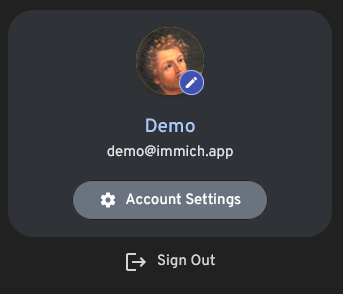

# User Settings

## App Settings

The user has the option of choosing how to display the browser interface in his user, this preference is personal for each user of the system.

Adjustment options include:

### Theme selection

Automatically set the theme to light or dark based on your browser's system preference

### Default Locale

Format dates and numbers based on your browser locale

### Display original photos

Prefer to display the original photo when viewing an asset rather than thumbnails when the original asset is web-compatible. This may result in slower photo display speeds.

### Play video thumbnail on hover

Play video thumbnail when mouse is hovering over item. Even when disabled, playback can be started by hovering over the play icon.

### Permanent deletion warning

Show a warning when permanently deleting assets

### People

Display a link to People in the sidebar

### Sharing

Display a link to Sharing (albums&partner sharing) in the sidebar

## Account

View your User ID and email, and update your first and last name.

## API Keys

Manage your API keys, you can define unlimited API keys and give them a name, you can learn more about Immich's API options in the [API documentation](/docs/api)

:::info
API keys are personal to each user, even the administrator's API key cannot control the settings or assets of other users.
:::

:::note
The API key cannot be viewed after it has been generated.
:::

## Authorized Devices

User can view all the devices connected to his account, in addition it is possible to view the last access time to the account for each connected device and remove access to a certain device if necessary.

## Memories

User can choose whether to display memories of his assets at the top of the timeline.

## Change Password

Users can change their own passwords.

:::tip Reset Password
The admin can reset a password through the [User Management](/docs/administration/user-management.mdx) screen.
:::

:::tip Reset Admin Password
The admin password can be reset using a [Server Command](/docs/administration/server-commands.md)
:::

## Partner Sharing

User can choose to share his library with another user in the system, for this section we have created a separate page where you can [learn about partner sharing](/docs/features/partner-sharing.md)
